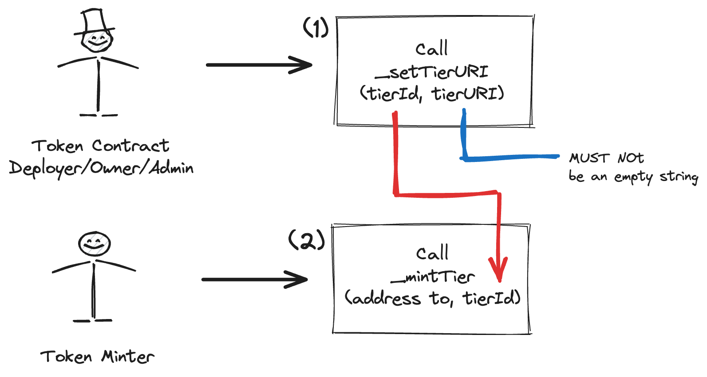
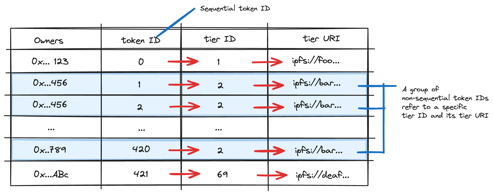

# ERC721T

## About
ERC721T is a ERC721 contract extension to manage each minted token ID to a specific identifier called as tier ID ("T" abbreviation comes from it). 

## Purpose
The purpose of this extension is to create a tier-based ERC721 NFT collection that the total rarity/rank or type/category of its collection is lesser than its total supply of tokens. The word "tier" is chosen, because it doesn't have to represent a rarity/rank, but it also can represent a type/category. 

## Example of Implementations
1. NFT creator creates a NFT collection, which the higher rank of NFT (in terms of totaly supply and its art/traits) is meant to be airdropped to/claimed by their early contributors as commemorative edition and at the same time the public are able to claim the lower rank of NFT (open edition; limited by time) freely within one token contract. One of the examples of this kind of token distribution is [Ethereum, Evolve: Shangai collection by Consensys](https://opensea.io/collection/shanghai-capella).

2. A host of the multiple-day event wants to appreciate their attendees to claim the POAP based on the day they attended the event within one token contract. In this case, there's no rarity applied to any POAP that represents the day of the event.

## Schema

1. Tier ID MUST be created before the mint event, by calling [`_setTierURI`](https://github.com/0xkuwabatake/ERC721T/blob/main/src/ERC721T.sol#L149) via child contract which the first argument is any arbitrarily `uint256` number as `tierId` and the second argument is `tierURI` that [MUST NOT be an empty string](https://github.com/0xkuwabatake/ERC721T/blob/main/src/ERC721T.sol#L150).

2. Token ID created sequentially by calling [`_mintTier`](https://github.com/0xkuwabatake/ERC721T/blob/main/src/ERC721T.sol#L120) via child contract which `tierId` as one of the arguments MUST have been defined at #1 beside of the target mint address. 

This mechanism will probably create a group of non-sequential token IDs refer to the same tier ID corresponds to its tier URI.

## ERC721T Example Contract at Testnet
The sample of this contract can be seen at [SimpleERC721T.sol](https://github.com/0xkuwabatake/ERC721T/blob/main/src/examples/SimpleERC721T.sol).

Since it is based season. The contract has been deployed at Base Sepolia Testnet Network.
| Contracts           | Address                                                                                                                  |
|---------------------|--------------------------------------------------------------------------------------------------------------------------|
| SimpleERC721T       | [0xE0d144BB99d62C3BA2eced59f1AB202A2f2ecb6B](https://sepolia.basescan.org/address/0xe0d144bb99d62c3ba2eced59f1ab202a2f2ecb6b) |

## Contributing
Feel free to make a pull request.

## Safety
This is experimental software and is provided on an "as is" and "as available" basis.

We do not give any warranties and will not be liable for any loss incurred through any use of this codebase.

ERC721T has been [minimaly unit-tested](https://sepolia.basescan.org/address/0xe0d144bb99d62c3ba2eced59f1ab202a2f2ecb6b), there may be parts that exhibit unexpected emergent behavior when used with other code, or break in future Solidity versions.

Please always include your own thorough tests when using ERC721T to make sure it works correctly with your code.